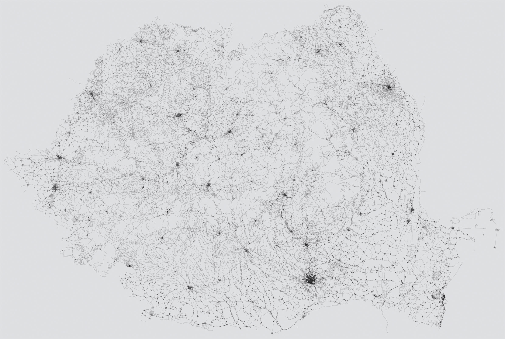

# every-street

Draw every street in Romania, based on OpenStreetMap data. 



Read the article here: [http://danburzo.ro/every-street](http://danburzo.ro/every-street)

## Installing

Clone this repository and run `npm install` on it.

## Using

Here's how to create a similar map for any area:

1. Dowload an `.osm.pbf` OpenStreetMap data file for your country/area from [download.geofabrik.de](http://download.geofabrik.de/) and place it into `data/data.osm.pbf`.
1. `node tools/extract-data.js` to extract node data into `output/nodes.txt` and street data into `output/streets.txt`;
1. `node tools/load-nodes.js` to load the nodes into a database so they can be looked up;
1. `node tools/apply-nodes.js` to replace the node IDs in your street file with the actual coordinates of the nodes into `output/streets-with-coordinates.txt`;
1. `node tools/bbox.js` to compute the bounding box and the aspect ratio for the map area into `output/bbox.json`;
1. `node tools/map-coords.js` to transform the geographical coordinates to screen coordinates using a Spherical Mercator projection into `output/streets-with-coordinates-mapped.txt`;
1. `node tools/generate-svg.js` to generate the final SVG.

Or, if you're brave enough, run them all in one fell swoop:

```bash
node tools/extract-data.js && node tools/load-nodes.js && node tools/apply-nodes.js && node tools/bbox.js && node tools/map-coords.js && node tools/generate-svg.js
```

...and wait... and wait.

### Converting the SVG to PNG

ImageMagick has worked for me:

```bash
convert -density 900 output/streets.svg output/streets.png
```
